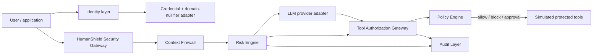

# HumanShield AI architecture

HumanShield is a security control plane that follows **VERIFY → UNDERSTAND → AUTHORIZE → ACT**. The MVP runs a local, deterministic security adapter so that it remains functional with no paid AI service. It deliberately treats demo identity and local persistence as replaceable adapters.

## Layers

- **Identity / credential layer:** `HumanCredentialProvider` creates only a local commitment. `DemoHumanCredentialProvider` demonstrates a future anonymous-credential or ZK replacement point. It neither requests nor stores biometrics or government ID.
- **ZK abstraction:** `generateProof`, `verifyProof`, and `generateDomainNullifier` are interfaces, not claims of production ZK cryptography. The current proof is a clearly labeled development artifact.
- **Trust layer / context firewall:** every context object has source, trust level, origin, timestamp, content hash, authority, and risk score. External data is never instruction authority.
- **Risk engine:** `CompositeRiskEngine` combines rule signals, provenance conflicts, and a multi-turn behavioral signal. A model-based analyzer can implement the same `RiskEngine` interface without altering the gateway.
- **LLM layer:** no provider key reaches a browser. The current MVP does not call a provider; `AI_API_KEY`/`AI_MODEL` are deployment placeholders for a server-only adapter.
- **Tool gateway:** the model has no direct tool connection. Role and risk policy are evaluated after risk analysis; high-risk paths create a `SecurityApproval`.
- **Audit layer:** events retain a content hash plus redacted/minimized metadata, not full prompt text by default.

## Production persistence

The local `MemoryStore` supports a no-service demo. `prisma/schema.prisma` is the PostgreSQL production model: User, Session, HumanCredential, DomainNullifier, SecurityEvent, Agent, Tool, ToolPolicy, SecurityApproval, and ApiKey. A production adapter must replace `MemoryStore`, run migrations, and make rate limiting/session storage distributed.
